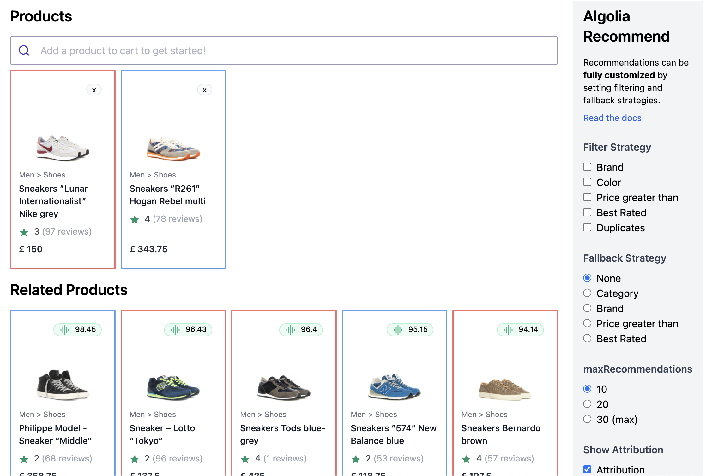

# Recommend Playground



Play with the [**demo**](https://algolia-recommend-playground.netlify.app/), or watch the [**recording**](https://video.algolia.com/watch/PLtXL9Vk6E2YjZtUCxZbU7)

The Recommend Playground can be used to demo Algolia Recommend for PDP and Checkout page use cases.

You can apply different filter and fallback strategies to illustrate the ability to customize which recommendations to show.

The Recommend Playground can be easily updated with your own recommendations, if available.


## Demo Overview

The main sources files are located in `index.html` and `src/app.js`. 

#### There are a few main sections of the code:

*  **Autocomplete** - used to populate the Shopping Cart
*  **Control Panel** - contains all the demo configuration options
*  **Recommendations Grid** - generates recommendations based on products in cart and selected configuration options


#### How does the code work? 

Every time a product is added to cart or a configuration option is changed, the demo updates the Recommend query params and sends another request. 

Recommend request parameters can be viewed in the console. 


## Modifying the Demo

> **NOTE**: This demo will only work if Recommend is activated on the App and the Related Products model is trained! 

This demo is available as a **Code Sandbox** template to make it easier for modification and testing: [https://codesandbox.io/s/icy-flower-etd6o](https://codesandbox.io/s/icy-flower-etd6o)

All App specific information is configured at [the top of `src/app.js`](https://github.com/kxu-algolia/recommend-playground/blob/master/src/app.js#L11-L54). 

There are a few steps to modify the demo to another App: 

* Update `appID`, `apiKey`, and `indexName` fields
* Update DISPLAY preferences array with `name`, `brand`, `gender`, etc - these get used to create the product cards. 

The getter functions (`getName()`, `getImage()`, etc) are available if there is any custom transformation or mapping logic that needs to be done.

Nested attributes are supported as well. For ex, if `images` is stored as an array and you want to use the first one for display purposes, you can use `images.0`. 


## Usage

```
npm install
npm run start 
```

## Changelog

### 1/24/22

  * Add support for filtering / faceting with multiple products
  * Refactor from to make it easier to swap appID in the demo
  * Publish on Netlify: algolia-recommend-demo.netlify.app

### 1/13/22
  * Publish initial version

